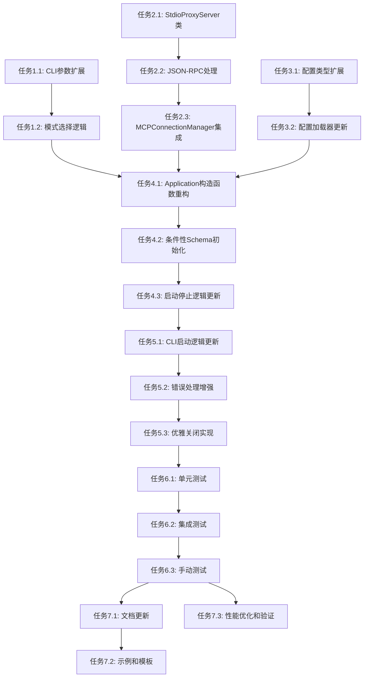

# 任务分解：命令行模式选择功能实现

## 实施任务列表

### 阶段1：CLI命令行参数扩展

#### 任务1.1：扩展CLI参数解析
**描述**：更新CLI类以支持新的命令行参数
**验收标准**：
- [x] 更新`src/cli.ts`中的CLIOptions接口
- [x] 添加`--stdio`和`--schema`参数解析逻辑
- [x] 添加参数冲突检测（不能同时指定--stdio和--http）
- [x] 更新帮助信息显示
**预计工时**：3小时
**依赖**：无

#### 任务1.2：实现模式选择逻辑
**描述**：实现根据命令行参数选择运行模式的逻辑
**验收标准**：
- [ ] 添加`parseModeArguments()`方法
- [ ] 实现默认HTTP模式逻辑
- [ ] 实现STDIO模式检测和schema参数处理
- [ ] 添加参数验证和错误处理
**预计工时**：2小时
**依赖**：任务1.1

### 阶段2：核心STDIO服务器实现

#### 任务2.1：创建StdioProxyServer类
**描述**：实现STDIO代理服务器的核心类
**验收标准**：
- [ ] 创建`src/core/StdioProxyServer.ts`文件
- [ ] 实现基础类结构和构造函数
- [ ] 实现`start()`和`stop()`方法
- [ ] 添加基础错误处理机制
**预计工时**：4小时
**依赖**：无

#### 任务2.2：实现JSON-RPC协议处理
**描述**：添加JSON-RPC 2.0协议解析和响应生成
**验收标准**：
- [ ] 实现JSON请求解析逻辑（监听stdin）
- [ ] 实现JSON响应格式化逻辑（输出到stdout）
- [ ] 支持所有JSON-RPC消息类型
- [ ] 添加输入验证和错误处理
**预计工时**：3小时
**依赖**：任务2.1

#### 任务2.3：集成MCPConnectionManager
**描述**：将STDIO服务器与现有的MCP连接管理器集成
**验收标准**：
- [ ] 实现请求转发到MCPConnectionManager
- [ ] 处理MCP操作结果并格式化响应
- [ ] 支持当前schema的MCP操作
- [ ] 添加STDIO模式特定的错误处理
**预计工时**：3小时
**依赖**：任务2.2

### 阶段3：配置系统扩展

#### 任务3.1：扩展配置类型定义
**描述**：更新配置类型以支持CLI模式和STDIO配置
**验收标准**：
- [ ] 更新`src/types/ConfigTypes.ts`
- [ ] 添加`STDIOConfig`接口
- [ ] 添加`CLIConfig`接口
- [ ] 更新JSON Schema定义
**预计工时**：2小时
**依赖**：无

#### 任务3.2：更新配置加载器
**描述**：确保配置加载器能够处理新的CLI配置
**验收标准**：
- [ ] 验证CLI配置加载逻辑
- [ ] 添加STDIO配置的默认值处理
- [ ] 实现配置验证规则
- [ ] 测试配置热重载功能（在HTTP模式下）
**预计工时**：2小时
**依赖**：任务3.1

### 阶段4：应用程序架构重构

#### 任务4.1：重构Application类构造函数
**描述**：修改Application类以支持模式参数
**验收标准**：
- [ ] 更新Application构造函数接受mode参数
- [ ] 根据模式条件性创建服务器实例
- [ ] 更新类属性和方法签名
- [ ] 保持向后兼容性
**预计工时**：3小时
**依赖**：任务2.3, 任务3.2

#### 任务4.2：实现条件性Schema初始化
**描述**：根据运行模式实现不同的schema初始化策略
**验收标准**：
- [ ] 添加`initializeSingleSchema()`方法
- [ ] 重构`initializeSchemas()`为`initializeAllSchemas()`
- [ ] 实现schema存在性验证（STDIO模式）
- [ ] 添加详细的错误信息
**预计工时**：4小时
**依赖**：任务4.1

#### 任务4.3：更新启动和停止逻辑
**描述**：更新Application的启动和停止方法
**验收标准**：
- [ ] 修改`start()`方法支持schema参数
- [ ] 根据模式创建相应的服务器实例
- [ ] 更新`stop()`方法处理不同类型的服务器
- [ ] 更新状态查询和日志记录
**预计工时**：2小时
**依赖**：任务4.2

### 阶段5：CLI集成和错误处理

#### 任务5.1：更新CLI启动逻辑
**描述**：更新CLI类以支持新的模式选择启动流程
**验收标准**：
- [ ] 修改`startApplication()`方法
- [ ] 添加`startHTTPMode()`和`startSTDIOMode()`方法
- [ ] 实现模式特定的启动信息显示
- [ ] 更新错误处理和退出逻辑
**预计工时**：3小时
**依赖**：任务4.3

#### 任务5.2：增强错误处理
**描述**：添加针对新模式和参数的错误处理
**验收标准**：
- [ ] 添加参数冲突检测和错误信息
- [ ] 添加schema不存在的错误处理
- [ ] 实现模式启动失败的详细错误信息
- [ ] 更新帮助信息和使用示例
**预计工时**：2小时
**依赖**：任务5.1

#### 任务5.3：实现优雅关闭
**描述**：确保两种模式都能正确处理信号和优雅关闭
**验收标准**：
- [ ] 验证STDIO模式的信号处理
- [ ] 确保STDIO模式能正确清理资源
- [ ] 测试两种模式的优雅关闭
- [ ] 更新日志记录和状态显示
**预计工时**：2小时
**依赖**：任务5.2

### 阶段6：测试和验证

#### 任务6.1：编写单元测试
**描述**：为新功能编写全面的单元测试
**验收标准**：
- [ ] 更新`src/cli.test.ts`测试新的参数解析
- [ ] 创建`src/core/__tests__/StdioProxyServer.test.ts`
- [ ] 测试JSON-RPC协议处理
- [ ] 测试MCP操作集成
- [ ] 测试错误处理逻辑
- [ ] 测试覆盖率>80%
**预计工时**：6小时
**依赖**：任务5.3

#### 任务6.2：编写集成测试
**描述**：编写端到端集成测试验证整体功能
**验收标准**：
- [ ] 创建模式选择集成测试
- [ ] 测试各种命令行参数组合
- [ ] 测试schema隔离和初始化
- [ ] 测试错误场景和边界情况
- [ ] 验证性能和稳定性
**预计工时**：4小时
**依赖**：任务6.1

#### 任务6.3：手动测试和验证
**描述**：进行手动测试验证实际使用场景
**验收标准**：
- [x] 测试所有命令行参数组合
- [x] 验证STDIO模式的MCP操作
- [x] 测试配置文件兼容性
- [x] 验证错误信息和用户体验
- [ ] 测试不同操作系统下的兼容性
**预计工时**：3小时
**依赖**：任务6.2

### 阶段7：文档和部署准备

#### 任务7.1：更新文档
**描述**：更新项目文档以反映新功能
**验收标准**：
- [ ] 更新README.md中的使用示例
- [ ] 更新命令行帮助信息
- [ ] 添加STDIO模式使用指南
- [ ] 更新配置文档和示例
- [ ] 添加故障排除指南
**预计工时**：3小时
**依赖**：任务6.3

#### 任务7.2：创建示例和模板
**描述**：创建配置示例和使用模板
**验收标准**：
- [ ] 创建STDIO模式配置示例
- [ ] 创建不同schema的配置模板
- [ ] 验证所有示例的正确性
- [ ] 添加使用场景示例
**预计工时**：2小时
**依赖**：任务7.1

#### 任务7.3：性能优化和最终验证
**描述**：基于测试结果进行优化和最终验证
**验收标准**：
- [ ] 分析性能指标并优化
- [ ] 验证内存使用改进
- [ ] 进行最终的回归测试
- [ ] 确认所有验收标准满足
**预计工时**：3小时
**依赖**：任务7.2

## 任务依赖关系图

## 关键里程碑

### 里程碑1：核心功能实现（第1-4阶段）
**目标**：完成模式选择和STDIO服务器的基础功能
**交付物**：
- 支持新参数的CLI系统
- 功能完整的StdioProxyServer类
- 重构的Application架构
- 扩展的配置系统
**预计完成时间**：3天

### 里程碑2：集成和错误处理（第5阶段）
**目标**：完成系统集成和全面的错误处理
**交付物**：
- 完整的CLI集成
- 健壮的错误处理机制
- 优雅关闭功能
- 用户体验优化
**预计完成时间**：1天

### 里程碑3：测试和文档（第6-7阶段）
**目标**：确保功能正确性、稳定性和用户友好性
**交付物**：
- 完整的测试覆盖
- 用户友好的文档
- 使用示例和模板
- 性能优化验证
**预计完成时间**：2天

## 风险缓解措施

### 技术风险
**风险**：STDIO输入输出处理复杂性
**缓解措施**：参考现有StdioMCPServer实现，使用成熟的Node.js流处理API

**风险**：架构重构可能引入回归问题
**缓解措施**：保持HTTP模式完全向后兼容，逐步重构并持续测试

### 进度风险
**风险**：CLI参数解析逻辑复杂度超预期
**缓解措施**：使用成熟的命令行解析库，参考类似项目的实现

**风险**：测试阶段发现架构问题
**缓解措施**：在开发过程中持续进行集成测试，尽早发现架构问题

## 质量标准

### 代码质量
- [ ] 所有代码通过ESLint检查
- [ ] 代码覆盖率>80%
- [ ] 符合项目编码规范
- [ ] 所有公共方法都有详细注释

### 功能质量
- [ ] 所有验收标准都已满足
- [ ] 通过所有测试用例
- [ ] 错误处理机制完整
- [ ] 日志记录详细准确

### 用户体验质量
- [ ] 命令行界面直观易用
- [ ] 错误信息清晰有用
- [ ] 帮助信息完整准确
- [ ] 文档详细易懂

### 性能质量
- [ ] STDIO模式响应时间<100ms
- [ ] 内存使用优化（仅初始化必要schema）
- [ ] 启动时间不增加
- [ ] 稳定运行时间>1小时

## 成功指标

### 功能指标
- [ ] 100%的命令行参数组合正确工作
- [ ] STDIO模式支持所有MCP协议操作
- [ ] Schema隔离机制正确工作
- [ ] 错误处理覆盖所有场景

### 性能指标
- [ ] STDIO模式内存使用减少30%以上
- [ ] 响应时间<100ms
- [ ] 启动时间不增加
- [ ] CPU使用率与HTTP模式相当

### 用户体验指标
- [ ] 用户能够成功使用所有新功能
- [ ] 错误信息能够帮助用户解决问题
- [ ] 文档覆盖所有使用场景
- [ ] 学习成本最小化