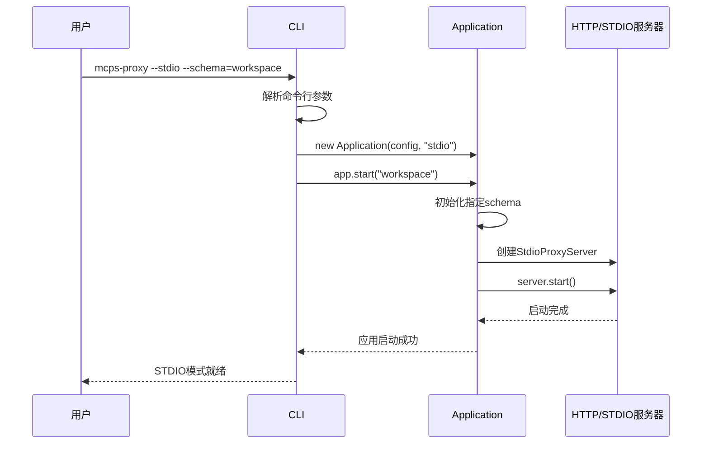
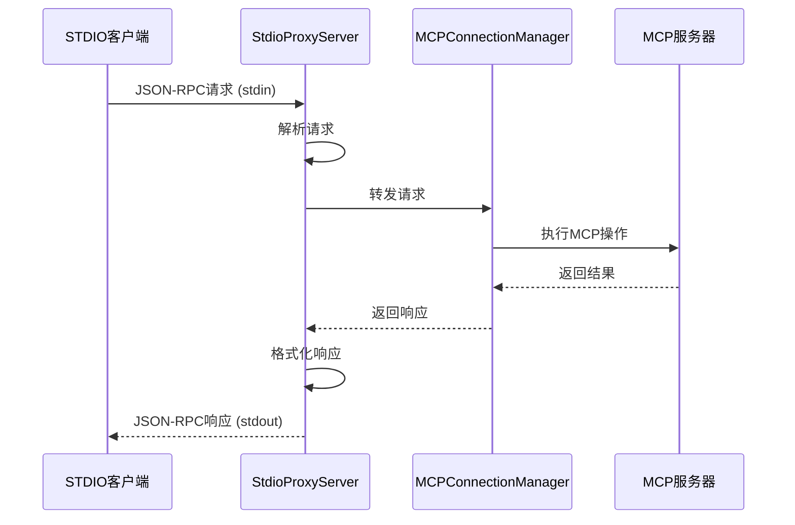

# 设计文档：命令行模式选择架构设计

## 架构概述

本设计文档详细说明了如何在现有MCPS Proxy架构基础上添加STDIO服务器模式支持，并通过命令行参数来选择运行模式。设计遵循现有架构模式，确保向后兼容性和代码一致性。

## 现有架构分析

### 当前架构组件
```
Application
├── HTTPServer (HTTP服务模式)
├── MCPConnectionManager (MCP连接管理)
├── ConfigLoader (配置加载)
└── Logger (日志系统)

MCPConnectionManager
├── StdioMCPServer (连接STDIO类型MCP服务器)
├── HTTPMCPServer (连接HTTP类型MCP服务器)
└── SSEMCPServer (连接SSE类型MCP服务器)
```

### 现有设计模式
- **接口抽象**：使用IMCPServer接口统一MCP服务器连接
- **依赖注入**：通过构造函数注入依赖
- **模块化设计**：按功能划分模块
- **配置驱动**：通过JSON配置管理所有设置

## 新架构设计

### 扩展后的架构
```
CLI
├── Application (根据模式创建不同服务)
│   ├── HTTPServer (HTTP服务模式) [条件创建]
│   ├── StdioProxyServer (STDIO服务模式) [条件创建]
│   ├── MCPConnectionManager (MCP连接管理) [保持不变]
│   └── Logger (日志系统) [保持不变]
└── 模式选择逻辑 [新增]
```

### 新增组件设计

#### 1. CLI模式选择逻辑

**职责**：根据命令行参数选择运行模式
- 解析`--stdio`和`--http`参数
- 解析`--schema`参数（STDIO模式使用）
- 选择创建相应的服务器实例
- 处理模式特定的启动逻辑

**接口设计**：
```typescript
interface CLIModeOptions {
    mode: "http" | "stdio";
    schema?: string; // STDIO模式使用
}

class CLI {
    private parseModeArguments(): CLIModeOptions;
    private async startHTTPMode(config: Config): Promise<void>;
    private async startSTDIOMode(config: Config, schema: string): Promise<void>;
}
```

#### 2. StdioProxyServer类

**职责**：处理STDIO模式的客户端通信
- 监听标准输入，解析JSON-RPC请求
- 调用MCPConnectionManager处理请求
- 将响应输出到标准输出
- 处理连接生命周期和错误恢复

**接口设计**：
```typescript
export class StdioProxyServer {
    private connectionManager: MCPConnectionManager;
    private config: STDIOConfig;
    private isRunning: boolean;
    private requestId: number;

    constructor(connectionManager: MCPConnectionManager, config: STDIOConfig);
    
    // 启动STDIO服务
    async start(): Promise<void>;
    
    // 停止STDIO服务
    async stop(): Promise<void>;
    
    // 检查运行状态
    isRunning(): boolean;
    
    // 处理客户端请求
    private handleRequest(request: JSONRPCRequest): Promise<JSONRPCResponse>;
    
    // 输出响应
    private sendResponse(response: JSONRPCResponse): void;
    
    // 错误处理
    private handleError(error: Error, id?: string | number): void;
}
```

#### 3. 扩展配置类型

**新增配置接口**：
```typescript
// STDIO模式配置
export interface STDIOConfig {
    encoding?: string;  // 默认'utf8'
    delimiter?: string; // 默认'\n'
    timeout?: number;   // 请求超时时间
}

// 命令行配置
export interface CLIConfig {
    mode: "http" | "stdio";
    schema?: string;    // STDIO模式下的schema名称
    stdio?: STDIOConfig;
}
```

#### 4. 扩展Application类

**新增方法**：
```typescript
export class Application {
    private server?: HTTPServer | StdioProxyServer;
    private connectionManager: MCPConnectionManager;
    private mode: "http" | "stdio";
    // ... 其他现有属性

    constructor(config: Config, mode: "http" | "stdio") {
        this.config = config;
        this.mode = mode;
        this.connectionManager = new MCPConnectionManager();
        // ... 其他现有初始化逻辑
    }

    public async start(schema?: string): Promise<void> {
        // 根据模式初始化schemas
        if (this.mode === "stdio") {
            // STDIO模式：仅初始化指定schema
            await this.initializeSingleSchema(schema || "default");
        } else {
            // HTTP模式：初始化所有schemas
            await this.initializeAllSchemas();
        }

        // 根据模式创建并启动服务器
        if (this.mode === "stdio") {
            this.server = new StdioProxyServer(this.connectionManager, this.config.cli?.stdio);
        } else {
            this.server = new HTTPServer(this.connectionManager, this.config.server);
        }
        
        await this.server.start();
        // ... 其他启动逻辑
    }

    public async stop(): Promise<void> {
        // 停止当前服务器
        if (this.server) {
            await this.server.stop();
        }
        // ... 其他清理逻辑
    }

    // STDIO模式专用：初始化单个schema
    private async initializeSingleSchema(schemaName: string): Promise<void>;
}
```

## 请求处理流程

### CLI模式选择流程



### STDIO模式请求处理流程



### 请求分发机制

**统一请求处理**：
- STDIO和HTTP模式共享相同的MCPConnectionManager
- 请求处理逻辑在MCPConnectionManager层统一
- 仅在通信层有所不同（stdin/stdout vs HTTP）

**Schema路由**：
- STDIO模式：在启动时指定schema，仅初始化该schema
- HTTP模式：初始化所有schemas，通过URL路径路由
- STDIO模式下请求不需要包含schema参数

## 错误处理策略

### 分层错误处理

1. **通信层错误**（StdioProxyServer）
   - JSON解析错误
   - 输入输出错误
   - 协议格式错误

2. **业务逻辑错误**（MCPConnectionManager）
   - Schema不存在
   - MCP服务器连接失败
   - 工具调用错误

3. **MCP服务器错误**
   - 服务器内部错误
   - 超时错误
   - 连接断开错误

### 错误响应格式

```typescript
// JSON-RPC错误响应
interface JSONRPCErrorResponse {
    jsonrpc: "2.0";
    id: string | number | null;
    error: {
        code: number;
        message: string;
        data?: any;
    };
}
```

## 生命周期管理

### 启动流程

#### HTTP模式启动流程
1. CLI解析`--http`参数（或默认HTTP模式）
2. Application构造函数创建HTTP模式实例
3. 初始化所有schemas
4. 启动MCPConnectionManager
5. 创建并启动HTTP服务器

#### STDIO模式启动流程
1. CLI解析`--stdio`和`--schema`参数
2. Application构造函数创建STDIO模式实例
3. 初始化指定schema（默认为"default"）
4. 启动MCPConnectionManager
5. 创建并启动STDIO服务器

### 停止流程
1. 停止接收新请求
2. 等待现有请求完成
3. 断开所有MCP连接
4. 停止当前服务器（HTTP或STDIO）
5. 清理资源

### 优雅关闭
- 处理SIGINT、SIGTERM信号
- 等待进行中的请求完成
- 关闭所有连接
- 清理资源

## 配置管理

### 配置文件示例

```json
{
  "$schema": "./schema.json",
  "server": {
    "port": 3095,
    "host": "127.0.0.1",
    "cors": {
      "enabled": true,
      "origins": ["*"]
    }
  },
  "cli": {
    "stdio": {
      "encoding": "utf8",
      "delimiter": "\n",
      "timeout": 30000
    }
  },
  "schemas": {
    "default": {
      "enabled": true,
      "mcpServers": {
        "filesystem": {
          "type": "stdio",
          "command": "npx",
          "args": ["@modelcontextprotocol/server-filesystem", "/tmp"]
        }
      }
    },
    "workspace": {
      "enabled": true,
      "mcpServers": {
        "git": {
          "type": "stdio",
          "command": "npx",
          "args": ["@modelcontextprotocol/server-git", "/repo"]
        }
      }
    },
    "tools": {
      "enabled": true,
      "mcpServers": {
        "memory": {
          "type": "stdio",
          "command": "npx",
          "args": ["@modelcontextprotocol/server-memory"]
        }
      }
    }
  },
  "logging": {
    "level": "info",
    "console": true
  }
}
```

### 配置验证
- 使用JSON Schema验证配置
- 提供默认值和错误提示
- 支持环境变量替换

## 命令行使用示例

### HTTP模式（默认）
```bash
mcps-proxy                    # 启动HTTP模式，支持所有schema
mcps-proxy --http             # 明确指定HTTP模式
mcps-proxy --port 8080        # 指定端口
```

### STDIO模式
```bash
mcps-proxy --stdio                         # 启动STDIO模式，使用default schema
mcps-proxy --stdio --schema=workspace     # 启动STDIO模式，使用workspace schema
mcps-proxy --stdio --schema=tools         # 启动STDIO模式，使用tools schema
```

## 性能考虑

### 内存管理
- STDIO模式仅初始化指定schema，减少内存占用
- 复用MCPConnectionManager，避免重复连接
- 及时清理请求上下文

### 并发处理
- STDIO模式天然串行，但内部可并发处理MCP请求
- HTTP模式支持并发HTTP请求
- 使用Promise.all并发处理多个MCP服务器请求

### 错误恢复
- 自动重连机制
- 请求失败重试
- 连接池管理

## 测试策略

### 单元测试
- StdioProxyServer类的核心方法
- CLI模式选择逻辑
- 配置解析和验证
- 错误处理逻辑

### 集成测试
- 端到端STDIO通信测试
- 命令行参数解析测试
- Schema选择逻辑测试
- 配置变更测试

### 性能测试
- STDIO模式响应时间测试
- 内存使用对比测试
- 并发处理能力测试

## 安全考虑

### 输入验证
- 严格的JSON解析
- 请求参数验证
- 防止注入攻击

### 权限控制
- 可配置的访问控制
- Schema级别权限
- 操作级别权限

### 日志安全
- 不记录敏感信息
- 结构化日志格式
- 日志轮转和清理

## 监控和调试

### 指标收集
- 请求处理数量
- 响应时间统计
- 错误率监控

### 调试功能
- 详细的错误日志
- 请求追踪ID
- 调试模式开关

### 日志格式
```typescript
interface LogEntry {
    timestamp: string;
    level: "error" | "warn" | "info" | "debug";
    service: "stdio" | "http" | "mcp";
    requestId?: string;
    message: string;
    data?: any;
}
```